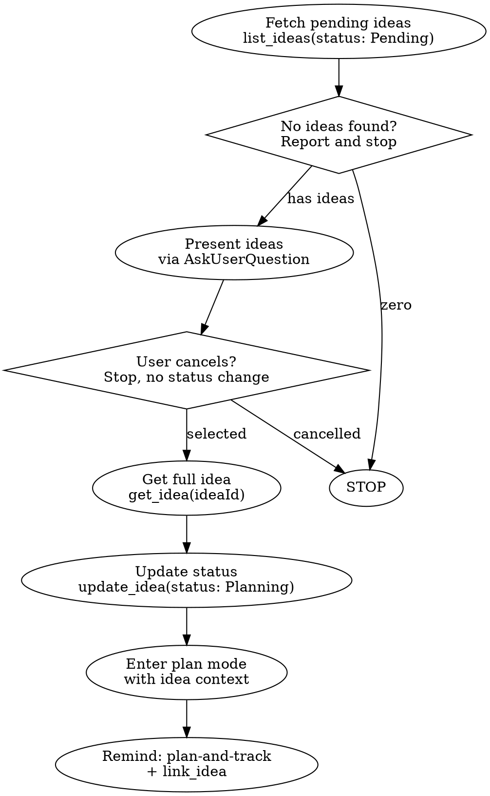

# Plan Idea

Select a pending idea from pm-tool and enter plan mode with its full context.

## Workflow

### Steps

1. **Fetch** — `mcp__pm-tool__list_ideas` with `status: "Pending"`. If empty, say "No pending ideas found" and stop.
2. **Present** — Show ideas via `AskUserQuestion` (max 4 options; user can type "Other" for full list). Format each option: `[Title] — Priority: [priority] — Tags: [tags]`.
3. **Get details** — `mcp__pm-tool__get_idea` for the selected idea.
4. **Update status** — `mcp__pm-tool__update_idea` setting `status: "Planning"`.
5. **Enter plan mode** — Call `EnterPlanMode`. Use the idea's title, description, priority, tags, and `ideaId` as planning context.
6. **Handoff** — After planning, remind:
   - Use `plan-and-track` skill to create tickets before writing code.
   - Use `mcp__pm-tool__link_idea` to connect the idea to the resulting spec/epic/task.

### Edge Cases

- **Zero ideas** — Report "No pending ideas" and stop. Do not enter plan mode.
- **User cancels selection** — Stop immediately. Do not update idea status.
- **Idea has no description** — Note this during planning; ask clarifying questions.
- **Always include `ideaId`** in plan context so `link_idea` can be called after ticket creation.
